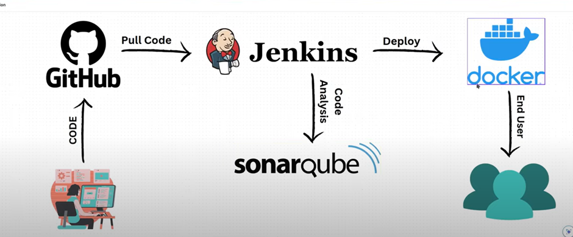
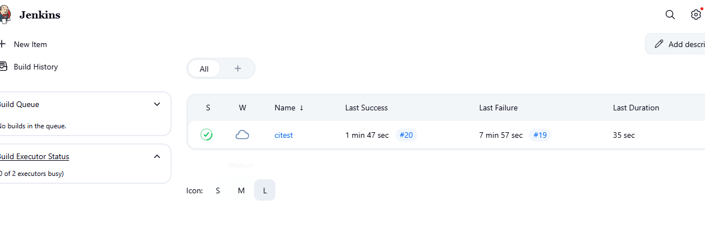
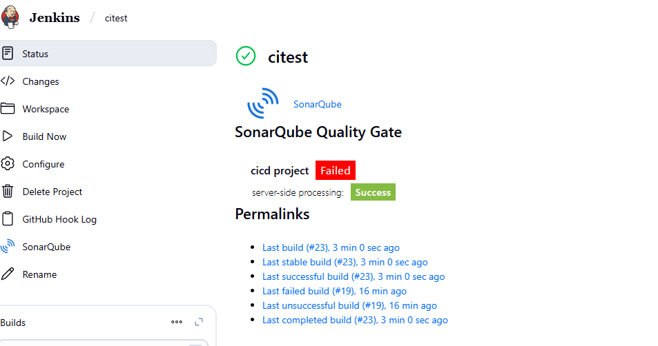
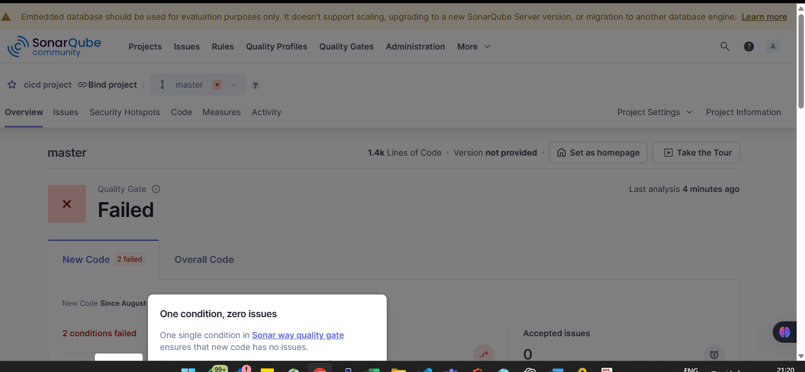
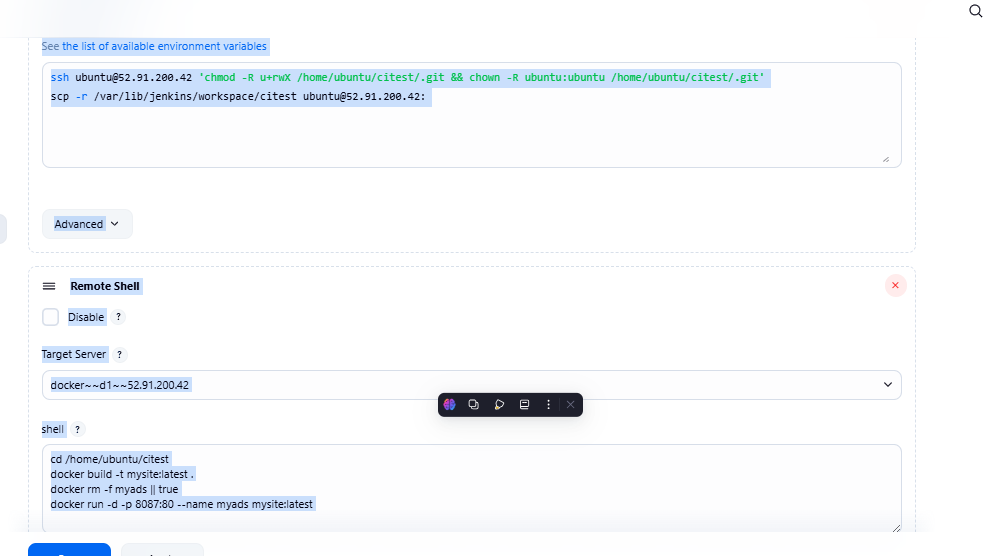
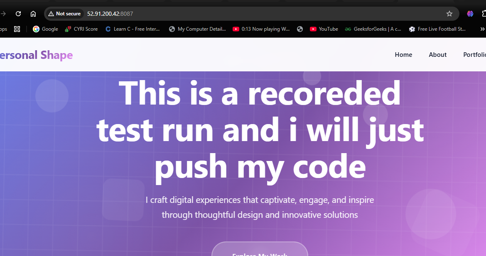

General

Description
Plain text
Preview

Discard old builds
?

GitHub project

This project is parameterized
?

Throttle builds
?

Execute concurrent builds if necessary
?
Advanced
Source Code Management
Connect and manage your code repository to automatically pull the latest code for your builds.
None
Git
?
Repositories
?
Repository URL
?
https://github.com/Adityacom7/CICD_Jenkins.git
Credentials
?

- none -
Add
Advanced

Add Repository
Branches to build
?
Branch Specifier (blank for 'any')
?
*/master

Add Branch
Repository browser
?

(Auto)
Additional Behaviours
Add
Triggers
Set up automated actions that start your build based on specific events, like code changes or scheduled times.

Trigger builds remotely (e.g., from scripts)
?

Build after other projects are built
?

Build periodically
?

GitHub hook trigger for GITScm polling
?

Poll SCM
?
Environment
Configure settings and variables that define the context in which your build runs, like credentials, paths, and global parameters.

Delete workspace before build starts

Use secret text(s) or file(s)
?

Add timestamps to the Console Output

Inspect build log for published build scans

Remote Shell
?

Terminate a build if it's stuck

With Ant
?
Build Steps
Automate your build process with ordered tasks like code compilation, testing, and deployment.
Execute SonarQube Scanner
JDK
?
JDK to be used for this SonarQube analysis

(Inherit From Job)
Path to project properties
?
Analysis properties
?
sonar.projectKey=cicd-project
Additional arguments
?

JVM Options
?

Execute shell
?

Command
See the list of available environment variables
ssh ubuntu@52.91.200.42 'chmod -R u+rwX /home/ubuntu/citest/.git && chown -R ubuntu:ubuntu /home/ubuntu/citest/.git'
scp -r /var/lib/jenkins/workspace/citest ubuntu@52.91.200.42:
Advanced
Remote Shell

Disable
?
Target Server
?

docker~~d1~~52.91.200.42
shell
?
cd /home/ubuntu/citest
docker build -t mysite:latest .
docker rm -f myads || true
docker run -d -p 8087:80 --name myads mysite:latest
Add build step
Post-build Actions
Define what happens after a build completes, like sending notifications, archiving artifacts, or triggering other jobs.
Add post-build action

